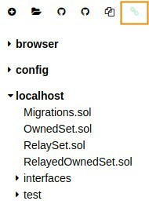

Now that every node is configured, and creates or import blocks we can create and deploy a Validator-set contract.
In this tutorial, `Alice` will deploy it and be the owner of the contract. In a real life use-case, Alice should be replaced by a multi-signature contract to prevent one single entity to control which account is allowed to seal blocks.

## 1. Deploy the Validator-set contract using remixd and Remix

### 1.1 Setup Remix and `remixd` 
To deploy the Validator-set contract, we will first download locally the contracts that will be used for Kovan Network. We chose to use the `remixd` tool and [Remix](https://remix.ethereum.org) for the deployment.
`remixd` is a convenient way to load local files to Remix and tedious manual work. Explanations on how to install `remixd` is outside of the scope of this tutorial. Please install it, we'll continue from there.

- Run the following command to copy the Validator-set contract's repository and got go to the contract's directory
```bash
git clone https://github.com/parity-contracts/kovan-validator-set.git && cd ./kovan-validator-set/contracts
```
- You can launch `remixd` from here to share the content of this directory by running:
```
remixd -s ./
```
- Visit [Remix](https://remix.ethereum.org) and verify that you can see your local file by clicking on the link symbol in the top left corner. If the connection is successfull, you should see your local files.



|[ ← Part 1 - Configuring each node ](Validator-Set-Tutorial-1.md)| [ Part 3 -  → ](Validator-Set-Tutorial-3.md)|